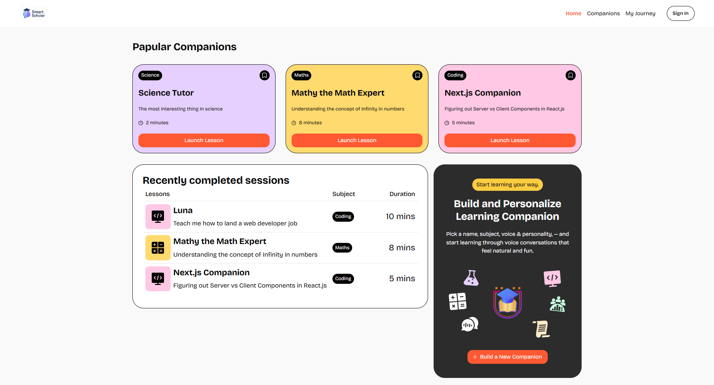
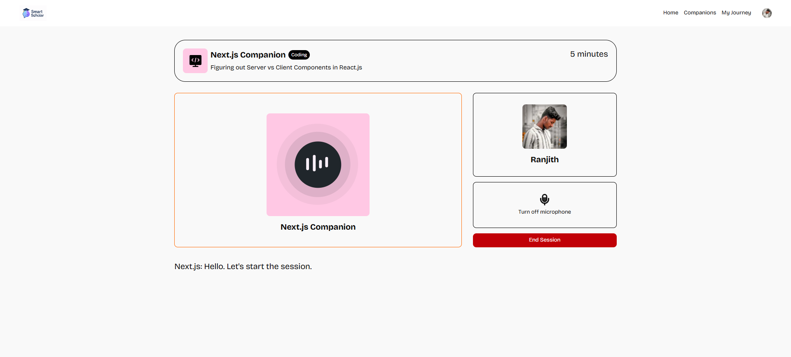

# 📚 Smart Scholar


**Smart Scholar** is an AI-powered Learning Management System (LMS) and SaaS platform that allows users to interact with real-time voice-based companions for personalized education.

🔗 **Live Demo:** [saas-app-ranjithbabu0912s-projects.vercel.app](https://saas-app-ranjithbabu0912s-projects.vercel.app/)

---

## ✨ Features

- 🎙️ AI voice assistant for learning interactions
- 🔐 Clerk-based auth and subscription billing
- 📚 Course and content management system
- 📦 Supabase-powered backend
- ⚡ Voice interaction via Vapi
- 🎨 Fully responsive UI with Tailwind CSS

---

## 🧱 Tech Stack

| Tech             | Description                          |
|------------------|--------------------------------------|
|  | React framework for SSR & routing |
|  | Typed JS for robust development |
|  | Utility-first CSS styling        |
|  | Auth & billing integration       |
|  | Realtime database & backend      |
|  | AI voice assistant platform      |
|  |(https://saas-app-ranjithbabu0912s-projects.vercel.app/) |
|   |(#license)       |

---

## 📸 Screenshots

> Upload images to your GitHub repo (e.g., `/public/screenshots/`) and replace the links below.

| Dashboard View | AI Companion |
|----------------|--------------|
|  |  |

You can also use external image hosting (like [Imgur](https://imgur.com/) or GitHub issues) for screenshots if needed.

---

## 📦 Getting Started

### 1. Clone the Repository

```bash
git clone https://github.com/ranjithbabu0912/smart-scholar.git
cd smart-scholar
```

### Install Dependencies

```bash
npm install
# or
yarn install
```

### Configure Environment Variables 
Create a .env.local file and add the following:

```bash
NEXT_PUBLIC_CLERK_PUBLISHABLE_KEY=your_clerk_publishable_key
CLERK_SECRET_KEY=your_clerk_secret_key

NEXT_PUBLIC_SUPABASE_URL=your_supabase_url
NEXT_PUBLIC_SUPABASE_ANON_KEY=your_supabase_anon_key
SUPABASE_SERVICE_ROLE_KEY=your_service_role_key

NEXT_PUBLIC_VAPI_WEB_TOKEN=your_vapi_web_token
```

### Run the App

```bash
npm run dev
```

Open your browser at http://localhost:3000.


### 🙋‍♂️ Author
Ranjith Babu S
Web Developer


### 📄 License
This project is licensed under the MIT License.
You are free to use, modify, and distribute it with proper attribution.